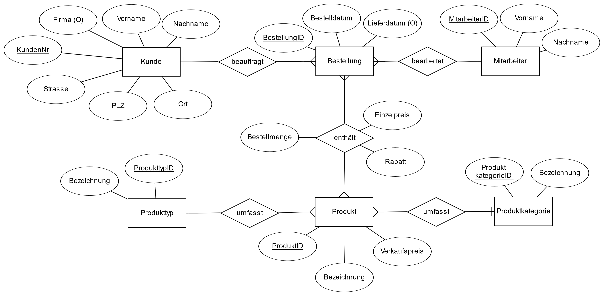

# Entity-Relationship-Modell (ER-Modell)

Das **ER-Modell** gilt als Standard für die **Datenmodellierung**, mit unterschiedlichen Darstellungsformen für Datenmodelle. Es wurde ursprünglich 1976 von **Peter Chen** vorgestellt.

Unser Modellierungswerkzeug im Kurs, **[ERDPlus.com](https://erdplus.com/)**, verwendet die **Krähenfuß-Notation** (Martin-Notation).

Detailliertere Informationen finden Sie im Herdt-Skript (Kapitel 2.4) und im Wikipedia-Artikel **[Entity-Relationship-Modell](https://de.wikipedia.org/wiki/Entity-Relationship-Modell)**.

Hier folgen die wichtigsten Schritte der Erstellung des ER-Modells am Beispiel *BikeShop*, einer start vereinfachten Version der Microsoft SQL Server Beispiel-Datenbank **[AdventureWorks2019](https://learn.microsoft.com/en-us/sql/samples/adventureworks-install-configure)**.

## Erster Modellierungsschritt: Entitätstypen, Beziehungen und Kardinalitäten

- Am Geschäftsprozess beteiligte Entitätstypen als Rechtecke notieren
- Beziehungen zwischen Entitätstypen durch Verbindungslinien mit Rauten identifizieren
  - Verbformen für die Beschriftung der beziehungen nutzen
- In welchem Mengenverhältnis stehen Entitäten der verschiedenen typen zueinander?
  - ErdPlus.com zeigt **Kardinalitäten** in der **Krähenfuß-Notation**
- Die korrekte Kardinalität ist Voraussetzung dafür, dass das Modell in der Praxis funktioniert.

## Zweiter Modellierungschritt: Primary Keys

- Jeder Entitätstyp bekommt ein Attribut (oder eine Gruppe von Attributen), dessen Werte jede einzelne Entität eindeutig identifizieren.
- Attribute werden als Ellipsen gezeichnet.
- Die Namen von Primärschlüsseln werden unterstrichen.

## Dritter Modellierungsschritt: Beschreibende Attribute

- Welche Daten sollen zu den einzelnen Entitätstypen gespeichert werden?
- Auch die n:m Beziehungen bekommen beschreibende Attribute.
- Die korrekte Platzierung der Attribute ist wichtig, damit das Modell in der Praxis funktioniert.

Das Modell wird als [Relationen-Modell](../Relationen-Modelle/Relationen-Modelle.md) weiter bearbeitet.
