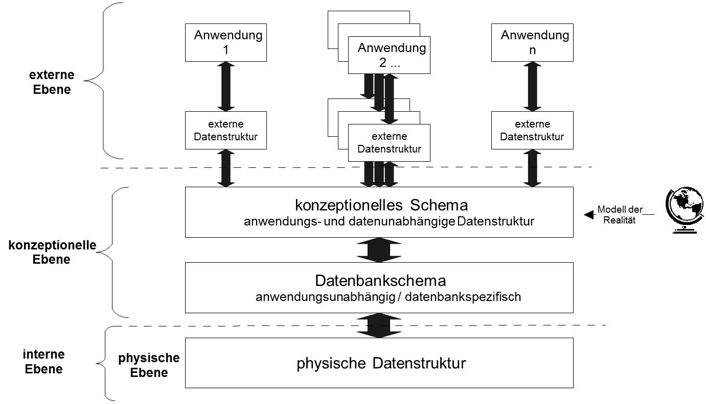

# ANSI-3-Ebenenmodell: ANSI-SPARC-Datenbankschema von 1975

Siehe: [ANSI-3-Ebenenmodell](http://wikis.gm.fh-koeln.de/Datenbanken/ANSI-3-Ebenenmodell)

Der Nutzen dieses Konzepts ist möglicher Gegenstand der IHK-Prüfung

