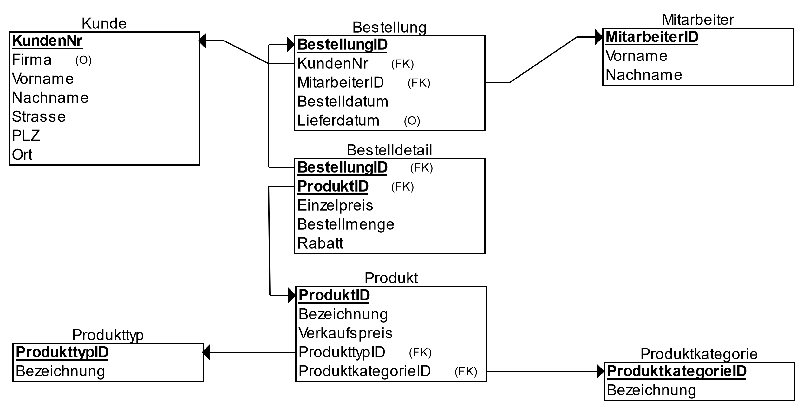

# Relationen-Modelle

Das **Relationen-Modell** verwendet die Notation des **[Klassen-Modells](https://de.wikipedia.org/wiki/Klassendiagramm)** aus der **[Unified-Modeling-Language](https://de.wikipedia.org/wiki/Unified_Modeling_Language)** (UML).

Jede **Relation** (=Tabelle) wird als Rechteck mit zwei Segmenten untereinander dargestellt. Oben steht der Name der Relation. Darunter sind die Attribute aufgelistet.

- **Primary Keys** werden mit **PK** markiert; **Foreign keys** mit **FK**.

- Attribute können auch als **optional** markiert werden (o).

- Hinter den Attributnamen werden Datentypen angegeben, wenn diese Detailtiefe gefordert ist.

Hinweis: [ERDPlus.com](https://erdplus.com) ermöglicht das Zuweisen von Datentypen im Relationen-Modell, zeigt sie aber im Modell selbst nicht an. Aber es lässt sich SQL-Code zum Erstellen der Tabellen aus dem Modell erzeugen.

## Wichtige Unterschiede zum ER-Modell

- Das Relationen-Modell erlaubt keine viele-zu-viele Beziehungen.
  - Eine Zwischentabelle löst die n:m Beziehung in zwei 1:n Beziehungen auf.
- Das Relationen-Modell zeigt die Foreign-Keys, die im ER-Modell normalerweise nicht eingezeichnet werden.  

## Das BikeShop Beispiel als Relationen-Modell

- Die Pfeilspitzen zeigen jeweils auf den Primary Key.
- Das andere Ende des Pfeils sitzt am Foreign Key.
- Primary Keys sind unterstrichen. Besser wäre zusätzlich die Angabe PK.
- In der Zwischentabelle *BestellDetail* ist zu erkennen, dass die Foreign Keys zusammen den Primary Key bilden, was typisch für Zwischentabellen ist.
- Zwei Attribute sind als *optional* angegeben.

