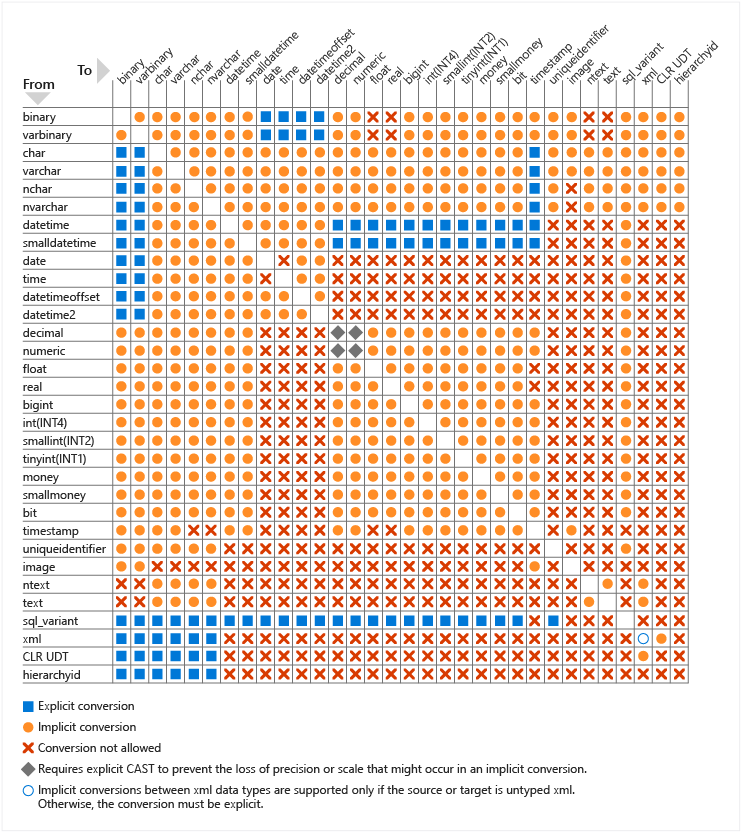

# Datentypen umwandeln und formatieren

- CAST und TRY_CAST
- CONVERT und TRY_CONVERT
- FORMAT

[Weiter geht's zur Demo...](Datentypumwandlung%20und%20Formatierung.ipynb)

## Implizite und explizite Typumwandlung

