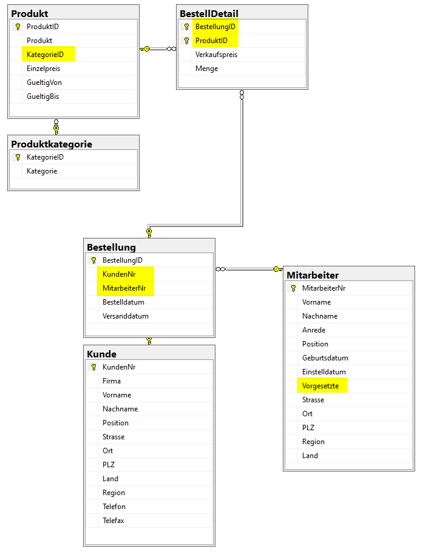

# Demo-Datenbank: *SQL_Seminar*

Stellen Sie die Demo-Datenbank aus der Backup-Datei *SQL_Seminar.bak* wieder her.

In jedem Notebook stellen Sie erneut die Verbindung mit dieser Datenbank her, um die Beispiele auszuführen.

## Datenmodell

Folgendes Modell zeigt die wichtigsten Tabellen der Datenbank *SQL_Seminar*. Die gelben Hervorhebungen sind Fremdschlüssel.

